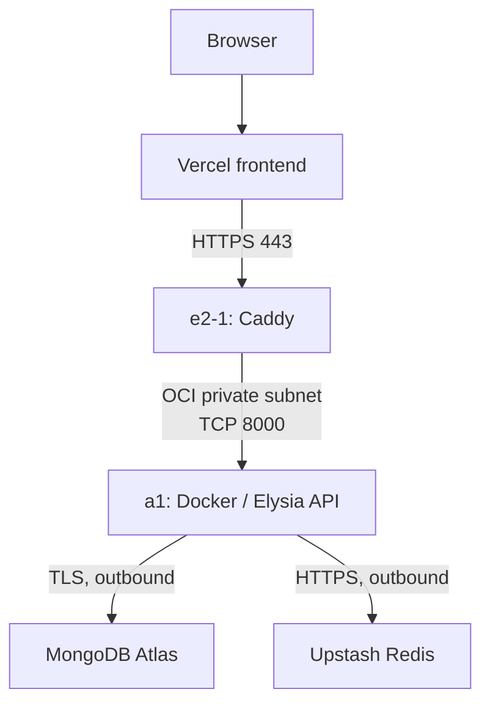
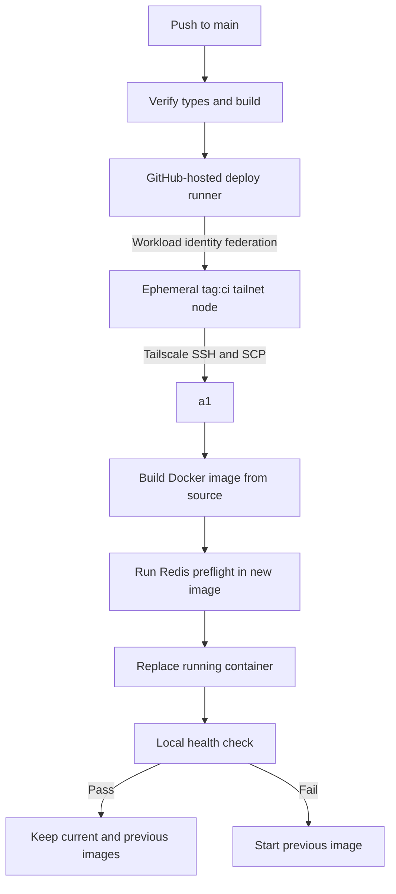

# Crossval

Crossval is a web application for monthly spending plans, actual spending, and variance reports.

## Prerequisites

Install these tools before you start:

- [Node.js](https://nodejs.org/) 20.9.0 or later
- [pnpm](https://pnpm.io/) 11.22.0
- [Docker](https://www.docker.com/) with Docker Compose

## Demo Video

[youtu.be/sgNpNzABpfw](https://youtu.be/sgNpNzABpfw)

## Live deployment

### Frontend

[crossval-web-five.vercel.app](https://crossval-web-five.vercel.app/)

### Backend

[OpenAPI Specification](https://crossval-web-five.vercel.app/api/openapi)

Production stack:

- Vercel: Next.js frontend
- Oracle Cloud Infrastructure (OCI): Dockerized Elysia API on a 2-OCPU, 12 GB RAM Arm compute instance
- MongoDB Atlas: production database
- Upstash Redis: distributed per-user rate-limit counters

### Deployment architecture

The frontend and API are separate applications. Vercel runs `apps/web` and rewrites same-origin `/api/*` requests to the OCI API configured by `API_UPSTREAM_URL`.

Requests then reach `crossval-api.rutam.duckdns.org` on the `e2-1` OCI VM. Caddy proxies them to the Elysia container at `10.0.0.201:8000` on `a1`. MongoDB Atlas provides the transactions used to enforce month locks.



### API runtime controls

Elysia TypeBox schemas validate API request bodies, query parameters, and response shapes. Valibot validates environment variables. The API publishes interactive Scalar documentation at `/openapi` and the OpenAPI specification at `/openapi/json`.

The frontend uses Eden Treaty instead of hand-written `fetch` calls. It derives request and response types from the exported Elysia `App` type, so the client stays in sync with the server routes without maintaining a second set of Zod schemas.

Authenticated application routes use one Upstash Redis limit: 300 requests per minute per authenticated user. Rejected requests return HTTP status `429` with a `Retry-After` header and identify the `user` policy. Better Auth's built-in rate limiter is disabled.

Configure Caddy manually on `e2-1` because the VM serves other applications. Crossval CI does not install or modify its Caddy configuration. `deploy/Caddyfile.crossval` is the version-controlled reference.

### Graceful shutdown

Docker manages the API container with the `unless-stopped` restart policy. When the container stops, Docker sends `SIGTERM` to the Node.js process and allows up to 30 seconds for shutdown. The process stops the Elysia server, closes the MongoDB connection, and exits.

### Network security

The deployment uses OCI security rules, UFW, private subnet routing, and Tailscale as separate controls.

Rules for `e2-1`:

| Inbound traffic allowed by UFW       | Purpose                                           |
| ------------------------------------ | ------------------------------------------------- |
| TCP `80` and `443` from the internet | HTTP redirect, TLS termination, and reverse proxy |
| UDP `41641`                          | Direct Tailscale connections                      |

Rules for `a1` and both VMs:

| VM   | Inbound traffic allowed by UFW        | Purpose                                             |
| ---- | ------------------------------------- | --------------------------------------------------- |
| `a1` | TCP `8000` from `e2-1` at `10.0.0.21` | Caddy-to-API traffic through the OCI private subnet |
| `a1` | UDP `41641`                           | Direct Tailscale connections                        |
| Both | Traffic on `tailscale0`               | Authenticated administration and deployment traffic |

UFW denies other inbound traffic by default. OCI security rules apply the same minimum-access model before traffic reaches each VM. SSH listens on the hosts, but the public firewall does not admit TCP `22`. Administrators connect through Tailscale instead.

The UDP `41641` rules permit direct WireGuard connections when NAT traversal succeeds. Tailscale can use a DERP relay when a direct connection is not available.

The `a1` VM still has a reserved public IP because releasing it could change the deployment address. The API does not use that address for normal request or deployment traffic. In a production deployment, I would remove the public IP from `a1`. This change would remove the unused public route and reduce the network surface.

### Secure CI/CD path

A push to `main` starts `.github/workflows/deploy-oci.yml`. The `verify` job type-checks and builds the API before deployment.

The `deploy` job joins the tailnet as an ephemeral `tag:ci` node by using GitHub Actions workload identity federation. The workflow sends a source archive to `a1` with SCP over Tailscale and runs deployment commands through SSH. Public SSH access and a container registry are not required.

`a1` must have Docker Engine installed and configured to start at boot. The workflow checks that Docker is available but does not install or configure the daemon.



The workflow extracts each source archive under `/opt/crossval/releases/<commit-sha>` and builds `crossval-server:<commit-sha>` with the Docker daemon on `a1`. Building on the Arm host produces the target architecture directly and avoids cross-platform image builds.

Before activation, the workflow runs the Upstash Redis preflight inside the new image with `/opt/crossval/server.env`. It tags the existing `crossval-server:current` image as `crossval-server:previous`, tags the new image as `crossval-server:current`, and replaces the named `crossval-server` container.

The container uses `--restart unless-stopped`, so Docker restarts it after process failures and Docker daemon or host restarts. It also uses `--stop-timeout 30` for graceful shutdown and `--network host` so Elysia sees Caddy's private IP as the TCP peer.

After replacement, the workflow checks `/api/health` on port `8000`. If the check fails and a previous Docker image exists, it removes the failed container and starts `crossval-server:previous`. The first Docker deployment has no automatic fallback to the former non-container service.

The first Docker deployment also disables and removes the old `crossval-server.service` unit so Docker becomes the only process supervisor for the API. The repository no longer installs or maintains a systemd unit for the container.

After a successful deployment, the workflow removes stale source releases and old `crossval-server:<commit-sha>` image tags while retaining the current and previous image revisions. It also prunes build cache that has not been used for seven days and limits retained build cache to 3 GB. The public request path and private deployment path remain independent, so Caddy can continue serving the active container while GitHub Actions uploads and builds the next revision through Tailscale.

The Docker Compose MongoDB configuration is only for local development.

## Local setup

1. Install the workspace dependencies from the project root:

   ```bash
   pnpm install
   ```

2. Copy the example environment files:

   ```bash
   cp apps/web/.env.example apps/web/.env
   cp apps/server/.env.example apps/server/.env
   ```

3. Generate an authentication secret:

   ```bash
   openssl rand -base64 32
   ```

4. Create a Google OAuth 2.0 client for a web application in Google Cloud Console.
5. Add this authorized JavaScript origin:

   ```text
   http://localhost:3000
   ```

6. Add this authorized redirect URI:

   ```text
   http://localhost:3000/api/auth/callback/google
   ```

7. Set `BETTER_AUTH_SECRET`, `GOOGLE_CLIENT_ID`, `GOOGLE_CLIENT_SECRET`, `UPSTASH_REDIS_REST_URL`, and `UPSTASH_REDIS_REST_TOKEN` in `apps/server/.env`.
8. Start MongoDB:

   ```bash
   pnpm db:start
   ```

9. Start the web and server applications:

   ```bash
   pnpm dev
   ```

10. Open [http://localhost:3000](http://localhost:3000). The Elysia API listens on [http://localhost:8000](http://localhost:8000).

Local MongoDB runs as a single-node replica set because month locking depends on MongoDB transactions. The per-user rate limiter uses the Upstash REST credentials from `apps/server/.env`.

For production, set `DATABASE_URL` to the MongoDB Atlas connection string and provide `UPSTASH_REDIS_REST_URL` and `UPSTASH_REDIS_REST_TOKEN`.

To run the MongoDB integration tests, keep MongoDB running and use:

```bash
pnpm test:integration
```

The tests use the `crossval_integration` database by default. Set `INTEGRATION_DATABASE_URL` to use a different test database.

To stop MongoDB, run:

```bash
pnpm db:stop
```

## Report behavior

### Missing actuals

The report treats a missing actual as zero. It shows `$0.00` in the Actual column and calculates the variance as `0 - Plan`. For example, a `$5,000.00` plan with no actual has a `-$5,000.00` variance and a `-100.00%` variance.

### Zero or missing plan

The report includes actual spending that has no plan for the same category and month. It treats the missing plan as zero, so unplanned spending remains visible in the report, chart, and CSV export. The report omits category-month combinations that have no plan and no actual.

The report shows `N/A` for the variance percentage when the plan is zero or missing. This prevents division by zero. It still calculates the amount variance as `Actual - Plan`.

### Fiscal-year range

The report has previous and next fiscal-year controls, so no fixed year list requires maintenance. Fiscal years use the calendar year from January through December. A user can still select start and end months directly. The fiscal-year control then shows **Custom range**.

### Monthly locking

Locks apply to one calendar month and one user. A locked month makes its plans and actuals read-only. Plan saves, actual saves, and CSV imports use MongoDB transactions. Each transaction checks and updates the period state before it writes data. Closing a month updates the same period state. MongoDB serializes these updates, so a write cannot commit after a concurrent request closes its month.

The interface disables the related inputs. The API rejects writes with HTTP status `423` and a clear error message. The current version does not support unlocking a month.

### CSV export

Use **Export CSV** in the variance report to download all report rows in the selected date range. The export uses the selected table sort order and is not limited to the current page. Amounts use decimal USD values. A zero plan has `N/A` in the Variance % column.

## CSV import

Use **Import CSV** in the Actual spend card. The file must contain these headers:

```csv
month,category,amount
2026-01,Marketing,4800
```

The import checks the month, category, and amount in each row. The import accepts category names in any letter case. The API rejects the file if a row is invalid or uses a locked month.

## Assumptions and tradeoffs

### Authentication

Crossval supports Google OAuth only. It does not support email and password authentication or magic links.

This choice reduces the authentication code and sensitive credential data in Crossval. Crossval depends on verified identity and email claims from Google. Crossval does not independently verify ownership through transactional email. Google manages passwords, multi-factor authentication, account recovery, and abuse controls. Crossval does not need password storage, password reset flows, or verification email delivery. Google sign-in also reduces access steps for users who have a Google account.

Google OAuth is not inherently secure in every deployment. It reduces the application-controlled authentication surface by delegating credential security to Google. Crossval must still protect OAuth secrets, redirect URIs, sessions, cookies, and user authorization.

The main tradeoff is provider dependence. Every user must have a Google account, and sign-in depends on Google availability and policy. Crossval cannot control Google account recovery. This choice can also exclude users or organizations that do not permit Google accounts.

Local credentials would require email verification, password reset, rate limits, and anti-enumeration controls. They would also require secure account linking and transactional email delivery.

### Rate-limit storage

Upstash Redis stores per-IP and per-user counters shared by API processes, so rate limits survive application restarts. Counter keys expire automatically. IPv6 keys represent `/64` networks rather than individual interface addresses.

A successful authenticated application request makes two Upstash REST rate-limit checks: the IP policy first and the user policy second. There is no process-local fallback or persistent Redis connection.

### Product and data model

- The application uses calendar months in `YYYY-MM` format. Fiscal years run from January through December. Custom fiscal-year start months are out of scope.

- All amounts use USD. The database stores nonnegative amounts as whole cents to prevent floating-point rounding errors.

- Marketing, Payroll, and Tools are a fixed seed list. Category CRUD is out of scope for this version.

- Each user can have one plan for each category and month. A user can add multiple actual entries. The report adds the entries together.

- CSV import accepts one file at a time. It has no preview. It rejects the full file if one row is invalid.

- Users cannot remove locks. An administrator or controlled lock removal process is necessary for corrections.

## Query approach at larger scale

The current schema has these main compound indexes:

- Plans: unique `{ userId, categoryId, month }` and report range `{ userId, month, categoryId }`
- Actuals: `{ userId, month, categoryId }`
- Period states: unique `{ userId, month }`

Report requests filter by `userId` and a bounded month range in MongoDB. One MongoDB aggregation groups actual entries, unions them with plans, joins category-month values, calculates variances, and sorts the result. A `$facet` stage returns only the requested page together with the total row count and monthly chart totals. The application does not load all report rows for a paginated request.

The dashboard plan, actual, and report lists use offset and limit pagination. The API limits each request to 50 rows. Report sorting supports month, category, and planned target. CSV export still reads all final report rows because the export contains the full selected range. Use query execution plans and production metrics to select more changes. These changes can include cursor pagination, export streaming, a reporting model, or more indexes.

## Tests

Run the server unit tests:

```bash
pnpm test
```

Run the integration tests while the local MongoDB service is active:

```bash
pnpm test:integration
```

Check all workspace types:

```bash
pnpm check-types
```

Build the Next.js frontend and Elysia API:

```bash
pnpm build
```
