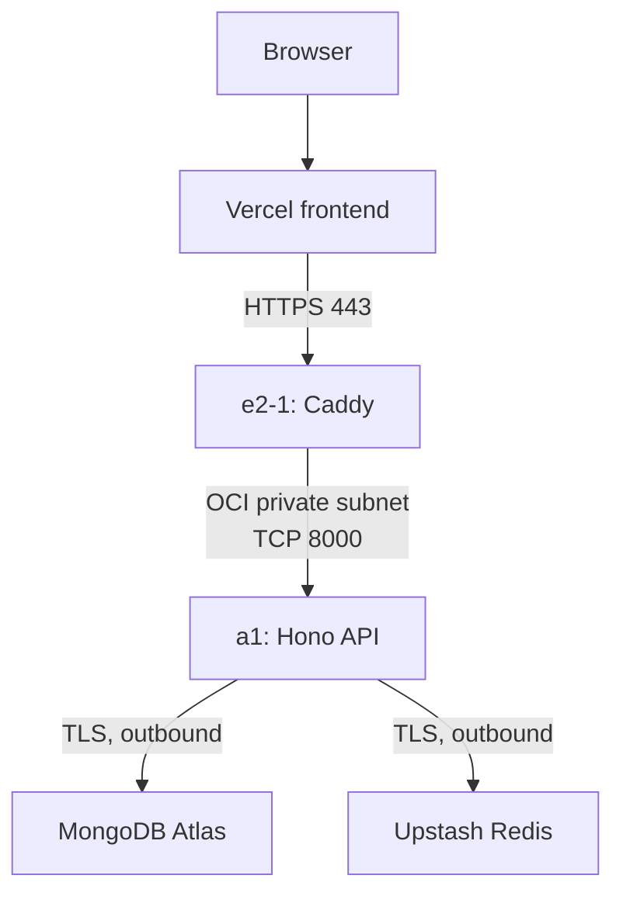
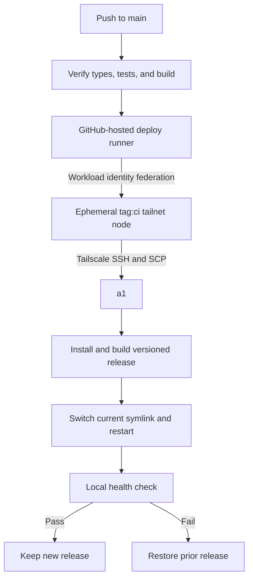

# Crossval

Crossval is a web application for monthly spending plans, actual spending, and variance reports.

## Prerequisites

Install these tools before you start:

- [Node.js](https://nodejs.org/) 20.9.0 or later
- [pnpm](https://pnpm.io/) 11.12.0
- [Docker](https://www.docker.com/) with Docker Compose

## Demo Video

[youtu.be/sgNpNzABpfw](https://youtu.be/sgNpNzABpfw)

## Live deployment

### Frontend

[crossval-web-five.vercel.app](https://crossval-web-five.vercel.app/)

### Backend

[92.5.75.7/crossval](https://92.5.75.7/crossval)

Production stack:

- Vercel: Next.js frontend
- Oracle Cloud Infrastructure (OCI): Hono API on a 2-OCPU, 12 GB RAM Arm compute instance
- MongoDB Atlas: production database

### Deployment architecture

The frontend and API are separate applications. Vercel runs `apps/web` and rewrites same-origin `/api/*` requests to the OCI API. The `API_UPSTREAM_URL` environment variable sets this upstream URL.

Public API requests first reach Caddy on the `e2-1` OCI VM. Caddy terminates TLS and removes the `/crossval` path prefix. It then proxies the request to `a1` at `10.0.0.201:8000` through the OCI private subnet. The 2-OCPU, 12 GB RAM Arm instance runs the Hono API. The API binds to its private address, not the public interface. MongoDB Atlas supports the transactions that enforce month locks.



### API runtime controls

The API uses ArkType for request and environment validation. This keeps validation CPU and memory use low on the constrained Arm instance.

An Upstash Redis-backed rate limiter applies to all API routes. It allows 120 requests per remote network address in each 60-second period. It blocks excess requests for 60 seconds and returns HTTP status `429`. Responses include `RateLimit-Limit`, `RateLimit-Remaining`, and `Retry-After` when applicable.

Redis stores shared counters with key expiry. An in-memory insurance limiter maintains rate-limit availability if Redis operations fail after application startup. Insurance counters are local to one server process and are not copied to Redis after recovery.

The API trusts `X-Forwarded-For` only when the direct socket peer matches `TRUSTED_PROXY_IP`. This setting defaults to Caddy at `10.0.0.21`. Requests from other peers use their direct socket address and ignore the forwarded header.

### Graceful shutdown

`SIGINT` or `SIGTERM` starts a graceful shutdown. The API stops new connections, closes idle connections, and waits for active requests. It then closes the MongoDB connection. A second signal or a 10-second timeout closes all remaining connections and forces the process to exit.

### Network security

The deployment uses OCI security rules, UFW, private subnet routing, and Tailscale as separate controls.

Rules for `e2-1`:

| Inbound traffic allowed by UFW       | Purpose                                           |
| ------------------------------------ | ------------------------------------------------- |
| TCP `80` and `443` from the internet | HTTP redirect, TLS termination, and reverse proxy |
| UDP `41641`                          | Direct Tailscale connections                      |

Rules for `a1` and both VMs:

| VM   | Inbound traffic allowed by UFW        | Purpose                                             |
| ---- | ------------------------------------- | --------------------------------------------------- |
| `a1` | TCP `8000` from `e2-1` at `10.0.0.21` | Caddy-to-API traffic through the OCI private subnet |
| `a1` | UDP `41641`                           | Direct Tailscale connections                        |
| Both | Traffic on `tailscale0`               | Authenticated administration and deployment traffic |

UFW denies other inbound traffic by default. OCI security rules apply the same minimum-access model before traffic reaches each VM. SSH listens on the hosts, but the public firewall does not admit TCP `22`. Administrators connect through Tailscale instead.

The UDP `41641` rules permit direct WireGuard connections when NAT traversal succeeds. Tailscale can use a DERP relay when a direct connection is not available.

The `a1` VM still has a reserved public IP because releasing it could change the deployment address. The API does not use that address for normal request or deployment traffic. In a production deployment, I would remove the public IP from `a1`. This change would remove the unused public route and reduce the network surface.

### Secure CI/CD path

A push to `main` starts `.github/workflows/deploy-oci.yml`. The `verify` job checks server types, runs tests, and builds the server before deployment.

The `deploy` job uses GitHub Actions workload identity federation to join the tailnet as an ephemeral `tag:ci` node. The workflow uses an OAuth client ID and audience, so it does not store a reusable Tailscale auth key. It waits until it can reach the Tailscale host `a1`.

The runner then uses SSH and SCP through Tailscale. It does not require public SSH access or the Caddy request path.



The workflow uploads a source archive and installs a versioned release under `/opt/crossval/releases`. The API uses `DATABASE_URL` for application data and `REDIS_URL` for shared rate-limit counters.

The workflow then switches the `current` symlink and restarts `crossval-server.service`. It checks `/api/health` on the VM. If the check fails, it restores the prior release and restarts the service.

The public request path and private deployment path are independent. Caddy can continue to serve the active release while GitHub Actions uploads and builds the next release through Tailscale.

The Docker Compose MongoDB and Redis configuration is only for local development.

## Local setup

1. Install the workspace dependencies from the project root:

   ```bash
   pnpm install
   ```

2. Copy the example environment files:

   ```bash
   cp apps/web/.env.example apps/web/.env
   cp apps/server/.env.example apps/server/.env
   ```

3. Generate an authentication secret:

   ```bash
   openssl rand -base64 32
   ```

4. Create a Google OAuth 2.0 client for a web application in Google Cloud Console.
5. Add this authorized JavaScript origin:

   ```text
   http://localhost:3000
   ```

6. Add this authorized redirect URI:

   ```text
   http://localhost:3000/api/auth/callback/google
   ```

7. Set `BETTER_AUTH_SECRET`, `GOOGLE_CLIENT_ID`, and `GOOGLE_CLIENT_SECRET` in `apps/server/.env`.
8. Start MongoDB and Redis:

   ```bash
   pnpm db:start
   ```

9. Start the web and server applications:

   ```bash
   pnpm dev
   ```

10. Open [http://localhost:3000](http://localhost:3000). The API listens on [http://localhost:8000](http://localhost:8000).

The local MongoDB database and Redis service require Docker. MongoDB runs as a single-node replica set because lock-safe writes use MongoDB transactions. The example configuration uses these connections:

```text
mongodb://localhost:27017/crossval?replicaSet=rs0
redis://localhost:6379
```

For production, set `DATABASE_URL` to the MongoDB Atlas connection string and `REDIS_URL` to the Upstash `rediss://` connection string.

To run the MongoDB and Redis integration tests, keep both services running and use:

```bash
pnpm test:integration
```

The tests use the `crossval_integration` database and `redis://localhost:6379` by default. Set `INTEGRATION_DATABASE_URL` or `REDIS_URL` to use different test services.

To stop MongoDB and Redis, run:

```bash
pnpm db:stop
```

## Report behavior

### Missing actuals

The report treats a missing actual as zero. It shows `$0.00` in the Actual column and calculates the variance as `0 - Plan`. For example, a `$5,000.00` plan with no actual has a `-$5,000.00` variance and a `-100.00%` variance.

### Zero or missing plan

The report includes actual spending that has no plan for the same category and month. It treats the missing plan as zero, so unplanned spending remains visible in the report, chart, and CSV export. The report omits category-month combinations that have no plan and no actual.

The report shows `N/A` for the variance percentage when the plan is zero or missing. This prevents division by zero. It still calculates the amount variance as `Actual - Plan`.

### Fiscal-year range

The report has previous and next fiscal-year controls, so no fixed year list requires maintenance. Fiscal years use the calendar year from January through December. A user can still select start and end months directly. The fiscal-year control then shows **Custom range**.

### Monthly locking

Locks apply to one calendar month and one user. A locked month makes its plans and actuals read-only. Plan saves, actual saves, and CSV imports use MongoDB transactions. Each transaction checks and updates the period state before it writes data. Closing a month updates the same period state. MongoDB serializes these updates, so a write cannot commit after a concurrent request closes its month.

The interface disables the related inputs. The API rejects writes with HTTP status `423` and a clear error message. The current version does not support unlocking a month.

### CSV export

Use **Export CSV** in the variance report to download all report rows in the selected date range. The export uses the selected table sort order and is not limited to the current page. Amounts use decimal USD values. A zero plan has `N/A` in the Variance % column.

## CSV import

Use **Import CSV** in the Actual spend card. The file must contain these headers:

```csv
month,category,amount
2026-01,Marketing,4800
```

The import checks the month, category, and amount in each row. The import accepts category names in any letter case. The API rejects the file if a row is invalid or uses a locked month.

## Assumptions and tradeoffs

### Authentication

Crossval supports Google OAuth only. It does not support email and password authentication or magic links.

This choice reduces the authentication code and sensitive credential data in Crossval. Crossval depends on verified identity and email claims from Google. Crossval does not independently verify ownership through transactional email. Google manages passwords, multi-factor authentication, account recovery, and abuse controls. Crossval does not need password storage, password reset flows, or verification email delivery. Google sign-in also reduces access steps for users who have a Google account.

Google OAuth is not inherently secure in every deployment. It reduces the application-controlled authentication surface by delegating credential security to Google. Crossval must still protect OAuth secrets, redirect URIs, sessions, cookies, and user authorization.

The main tradeoff is provider dependence. Every user must have a Google account, and sign-in depends on Google availability and policy. Crossval cannot control Google account recovery. This choice can also exclude users or organizations that do not permit Google accounts.

Local credentials would require email verification, password reset, rate limits, and anti-enumeration controls. They would also require secure account linking and transactional email delivery.

### Rate-limit storage

Upstash Redis stores shared, disposable counters across API processes and preserves rate-limit behavior during application restarts. Counter keys expire automatically. The API connects through TLS with one persistent Redis connection per process.

This adds a network request to each rate-limit check and makes Upstash an external runtime dependency. An in-memory insurance limiter keeps the API available during Redis failures. The limiter does not synchronize its process-local counters after recovery.

### Product and data model

- The application uses calendar months in `YYYY-MM` format. Fiscal years run from January through December. Custom fiscal-year start months are out of scope.

- All amounts use USD. The database stores nonnegative amounts as whole cents to prevent floating-point rounding errors.

- Marketing, Payroll, and Tools are a fixed seed list. Category CRUD is out of scope for this version.

- Each user can have one plan for each category and month. A user can add multiple actual entries. The report adds the entries together.

- CSV import accepts one file at a time. It has no preview. It rejects the full file if one row is invalid.

- Users cannot remove locks. An administrator or controlled lock removal process is necessary for corrections.

## Production improvements

Make these changes before production use:

- Add category management, CSV previews, and import history.

- Add an audited lock removal process with clear user permissions.

- Add route-specific rate limits for authentication and general API traffic.

- Review OAuth, session, cookie, and token-revocation controls.

- Add centralized request logs, error monitoring, and external health monitoring.

- Configure and verify MongoDB Atlas backups. Test database recovery.

- Add more integration and browser tests for authentication and report workflows.

- Complete an accessibility and security review.

## Query approach at larger scale

The current schema has these main compound indexes:

- Plans: unique `{ userId, categoryId, month }` and report range `{ userId, month, categoryId }`
- Actuals: `{ userId, month, categoryId }`
- Period states: unique `{ userId, month }`

Report requests filter by `userId` and a bounded month range in MongoDB. One MongoDB aggregation groups actual entries, unions them with plans, joins category-month values, calculates variances, and sorts the result. A `$facet` stage returns only the requested page together with the total row count and monthly chart totals. The application does not load all report rows for a paginated request.

The dashboard plan, actual, and report lists use offset and limit pagination. The API limits each request to 50 rows. Report sorting supports month, category, and planned target. CSV export still reads all final report rows because the export contains the full selected range. Use query execution plans and production metrics to select more changes. These changes can include cursor pagination, export streaming, a reporting model, or more indexes.

## Tests

Run the server unit tests:

```bash
pnpm test
```

Run the database and server integration tests while the local MongoDB replica set is active:

```bash
pnpm test:integration
```

Check all workspace types:

```bash
pnpm check-types
```

Build the Next.js frontend and Hono server:

```bash
pnpm build
```
